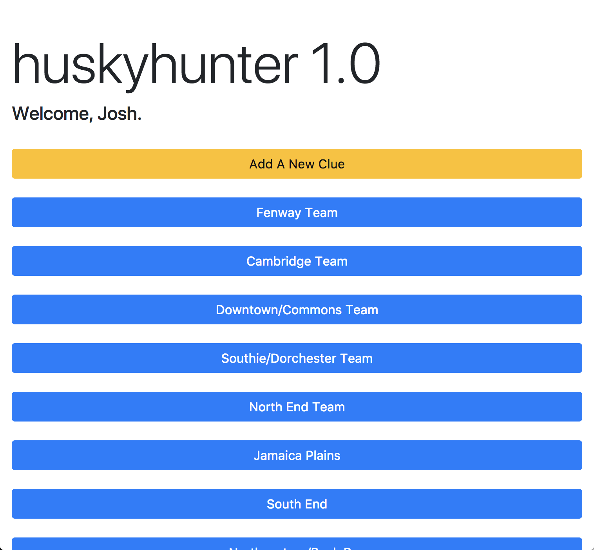
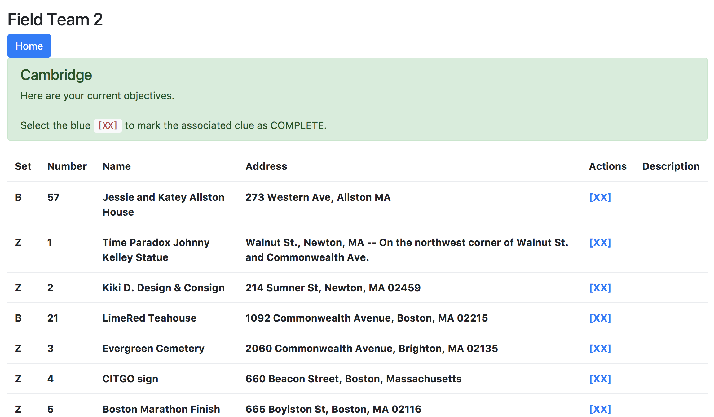
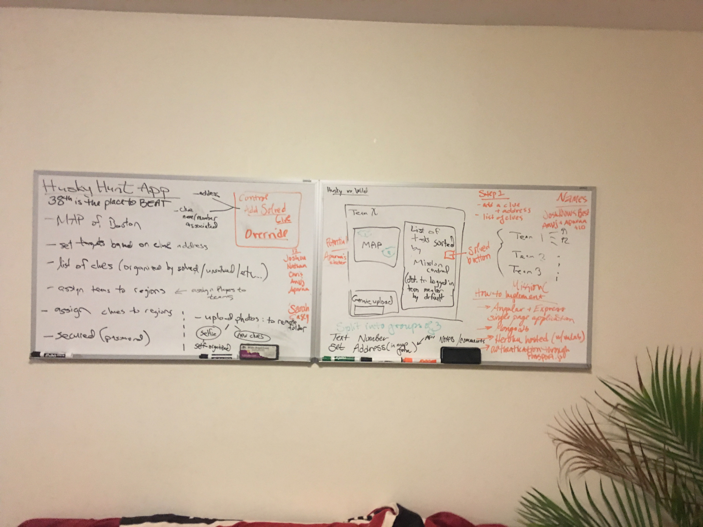

# HuskyHunter 1.0

App written for use for Husky Hunt 2017, for use by the team "The Real Huskies of Suffolk County".
Enables coordination between clue decoders at the team's headquarters, and other members of the team out in the field.
Provides a centralized point of data organization and clue completion.  Dropbox integration allows field teams to upload their completed clues to a secure location.  The application auto-names a completed clue based on the provided clue syntax.

 The app is hosted at <code>http://huskyhunter.herokuapp.com</code> 

  

  

  

 
This application has humble beginnings as a concept written on apartment whiteboards.

  

