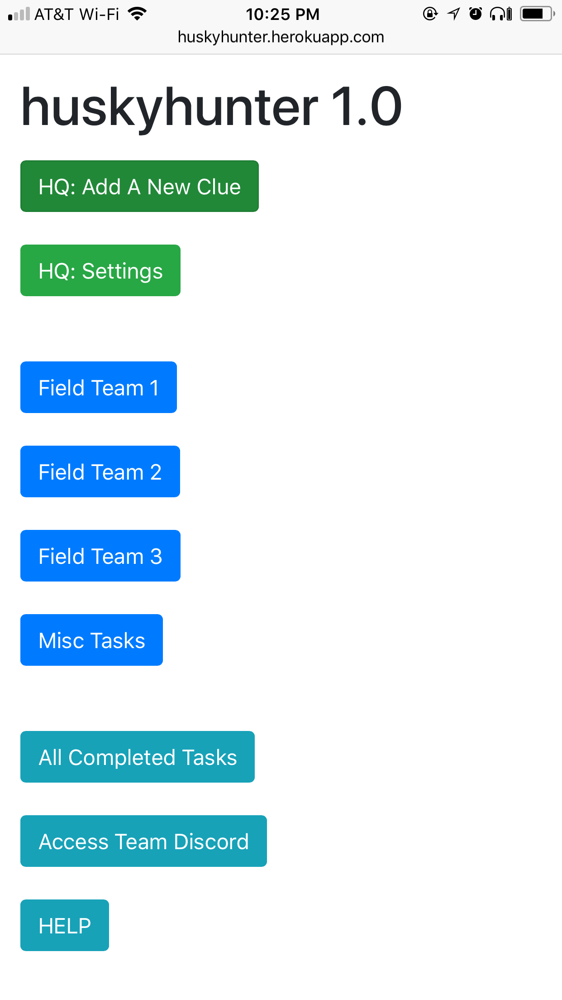

# HuskyHunter

App written for use for Husky Hunt 2017, for use by the team "The Real Huskies of Suffolk County".
Enables coordination between clue decoders at the team's headquarters, and other members of the team out in the field.
Provides a centralized point of data organization and clue completion.

  

 
This application has humble beginnings as a concept written on apartment whiteboards.

  

